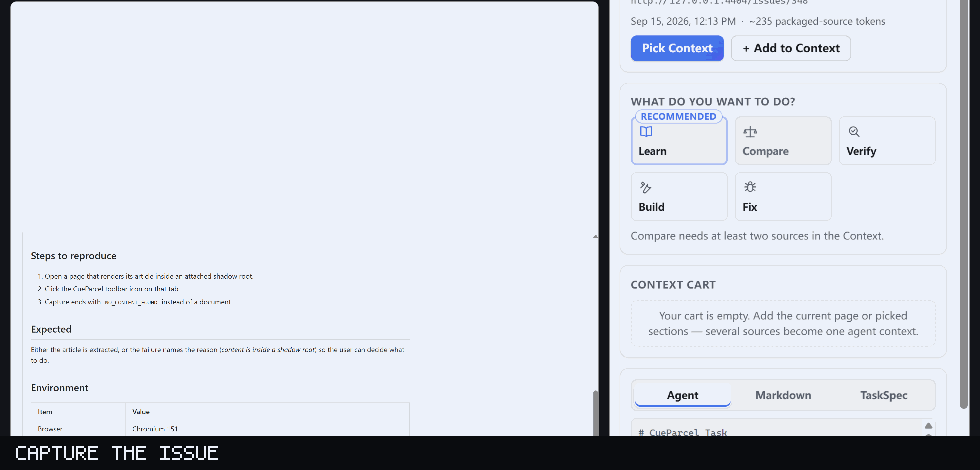
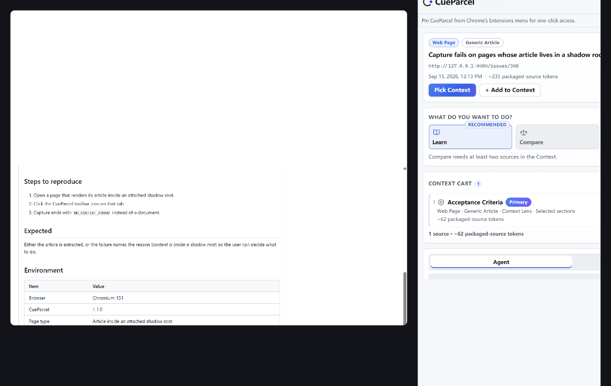
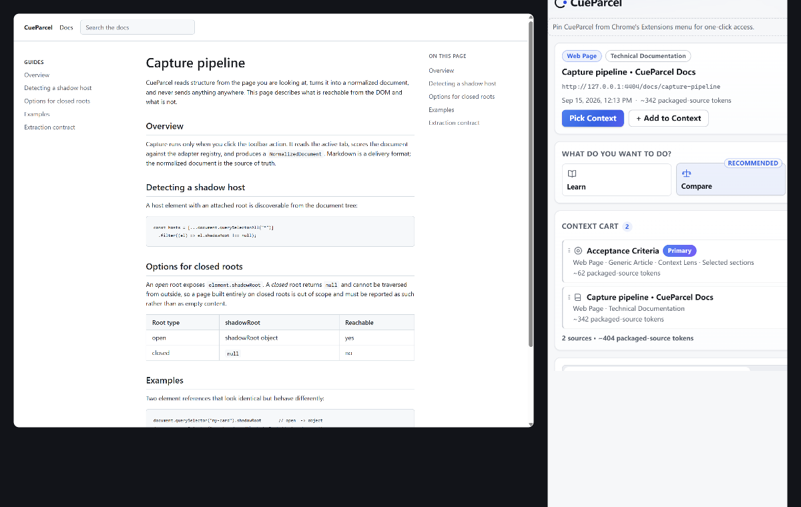
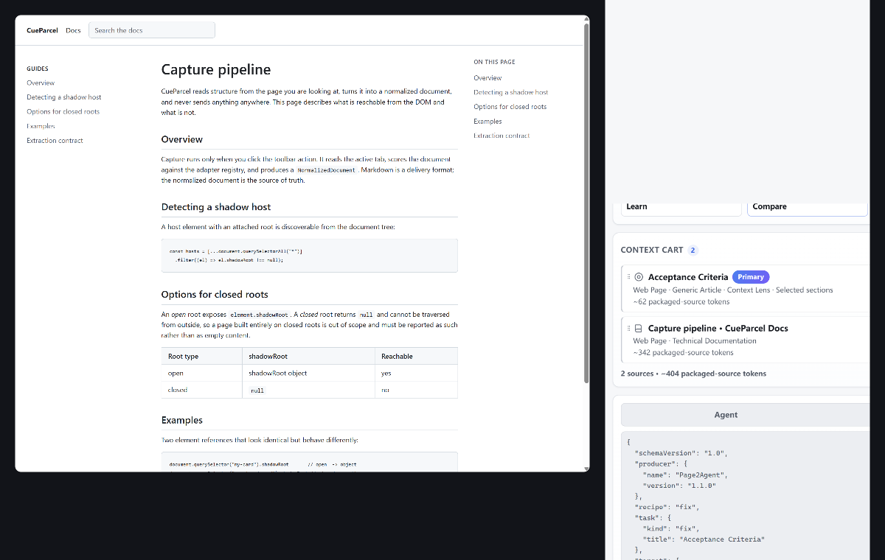

<div align="center">


# CueParcel

**Pick what matters. Pack it for AI.**

Turn any webpage into clean, source-grounded context for AI.
CueParcel lets you visually pick what matters, combine multiple sources,
choose what you want AI to do, inspect the package, and copy it to any agent.

**No backend · No telemetry · No API key · Local-first**

[](https://github.com/kallist/CueParcel/actions/workflows/ci.yml)
[](LICENSE)
[](#privacy--permissions)
[](CHANGELOG.md)

[English](README.md) · [简体中文](README_ZH.md)

[**Download / Quick Start**](#quick-start) · [**See it in action**](#see-cueparcel-in-action) · [**Why CueParcel**](#why-cueparcel) · [**Privacy**](#privacy--permissions)


</div>

<!--
  The repository's social preview (Settings -> General -> Social preview) is a
  GitHub UI setting with no file-based equivalent, so the prepared 1280x640 card
  (docs/assets/cueparcel-social-preview.png) is deliberately NOT embedded above:
  GitHub would render the raw PNG at full width as a large block of text-and-logo
  with nothing for a reader to learn. It is uploaded manually — see
  docs/launch/PLAN.md.
-->

---

> **Every visual in this README is a real screenshot of the production extension.**
> Nothing here is a mockup. The images are generated by driving the actual built
> extension in a real Chromium window (see [Reproducing the screenshots](#reproducing-the-screenshots)).
> Captions state exactly which page and which adapter each image shows.

## See CueParcel in action

A real recording of the product: capture a bug report, pick one section with the
Context Lens, add a documentation source, choose **Fix**, and inspect the
**TaskSpec** and **Context Receipt** before copying.



### Three real examples

Each of these is a real screenshot of the production extension. They are stacked
rather than laid out side by side so they stay readable in a narrow window.

#### Fix an issue



Pick the acceptance criteria out of the report, add the documentation as a
reference source, choose **Fix** — turn an issue into a source-grounded repair
brief.

#### Compare sources



Add both pages as sources and choose **Compare**. It stays disabled until there
really are two sources, so a comparison is never invented from one.

#### Build from docs



Pick the relevant documentation sections and choose **Build** — package them for
implementation.

## Why CueParcel

Copying a URL asks the agent to go and find context. Copying the page hands it
navigation, footers and unrelated sections. CueParcel is the middle path: you
choose the context, and you can see exactly what you chose.

Each row below compares the same three approaches.

#### Scope control

- **Copy the URL:** ✗ the agent fetches everything
- **Copy / paste the page:** ✗ the whole page goes in
- **CueParcel:** ✓ pick sections visually

#### Multiple sources

- **Copy the URL:** one at a time
- **Copy / paste the page:** manual concatenation
- **CueParcel:** ✓ Context Cart

#### Source roles

- **Copy the URL:** ✗
- **Copy / paste the page:** ✗
- **CueParcel:** ✓ Task / Reference / Evidence / Example / Selection

#### Source vs generated separation

- **Copy the URL:** ✗
- **Copy / paste the page:** ✗
- **CueParcel:** ✓ enforced in every layer

#### Provenance

- **Copy the URL:** ✗
- **Copy / paste the page:** ✗
- **CueParcel:** ✓ type + capture method + scope, never conflated

#### Task intent

- **Copy the URL:** typed by hand each time
- **Copy / paste the page:** typed by hand each time
- **CueParcel:** ✓ Learn / Compare / Verify / Build / Fix

#### Machine-readable contract

- **Copy the URL:** ✗
- **Copy / paste the page:** ✗
- **CueParcel:** ✓ versioned TaskSpec JSON

#### Local-first

- **Copy the URL:** depends on the agent
- **Copy / paste the page:** depends on the agent
- **CueParcel:** ✓ nothing leaves the browser

#### Inspect before sending

- **Copy the URL:** ✗
- **Copy / paste the page:** ✗
- **CueParcel:** ✓ Agent / Markdown / TaskSpec + Receipt

## Quick Start

CueParcel is not on any extension store yet. **Chrome Web Store publication is
planned, not shipped**, and there is no downloadable release yet either — the
first release is being prepared. Both routes below work today.

### A. Build it and load it unpacked (works today)

Prerequisites: **Node.js 24** (see `.nvmrc`).

```bash
git clone https://github.com/kallist/CueParcel.git
cd CueParcel
npm ci
npm run build          # -> dist/
```

Then:

1. Open `chrome://extensions` — on Edge, `edge://extensions`.
2. Turn on **Developer mode** (top right).
3. Click **Load unpacked** and select the `dist/` folder you just built.
4. Pin CueParcel: click the Extensions (puzzle-piece) icon in the toolbar, then
   the pin next to **CueParcel**.

> Chrome requires the user to pin an extension; CueParcel cannot pin itself.
> When it detects it is not pinned it shows a short, dismissible getting-started
> card saying exactly that, and stays quiet once dismissed.

Then click the CueParcel icon on any page: capture runs and the Side Panel opens.
Keyboard alternative: **`Alt+Shift+Y`**.

### B. From a release ZIP (once a release exists)

`npm run package:release` produces a loadable archive at the repository root:

```bash
npm run package:release     # -> cueparcel-v1.1.0-chromium.zip + SHA256SUMS.txt
```

Unzip it and load the **unzipped folder** with **Load unpacked** as in steps 1–4
above. `manifest.json` is at the archive root, so the unzipped folder is the
extension folder — do not point Chrome at a parent directory.

When the first GitHub Release is published, the same ZIP will be attached there;
until then, build it as above. Release mechanics are documented in
[docs/launch/RELEASE.md](docs/launch/RELEASE.md).

## What it understands

### The six V1.1 capabilities

1. **Context Lens** — an in-page visual picking mode. Semantic regions
   (sections, code blocks, tables, lists, GitHub issue areas) are highlighted on
   hover with a live `selected-content tokens` count; one click includes or
   excludes an area. **The page DOM is never modified.**
2. **Context Cart** — combine multiple pages, picked sections and text
   selections into one agent context. Roles (`Task`, `Reference`, `Evidence`,
   `Example`, `Selection`), a single primary source, reorder, undo, clear.
   Session-only and private.
3. **Context Recipes** — no prompt writing: pick what the agent should do —
   `Learn`, `Compare`, `Verify`, `Build`, `Fix`. Recipes are suggested from
   adapter analysis, but the user stays in control.
4. **Semantic Adapter 2.0** — Generic Article, GitHub Issue, GitHub Pull
   Request, and Technical Documentation detection, with an honest fallback to
   generic when confidence is insufficient.
5. **TaskSpec** — a versioned, portable, deterministic JSON task contract
   (sources, roles, provenance, adapter-verified source facts, acceptance
   criteria only when the source really provides them, unknowns, generated
   instructions, token estimates) that other tools can consume without any
   CueParcel internals.
6. **Context Receipt + Nutrition Label** — a compact summary of exactly what the
   agent will receive (total-context tokens and the source/generated/metadata
   split), expanding into Included/Excluded facts, generated-vs-source
   separation, unknowns and observable context facts. No fake quality scores.

### Three provenance dimensions, never conflated

"What the source is", "how it was captured" and "how much was captured" are
independent facts, so a GitHub Issue cropped with the Context Lens is still a
GitHub Issue:

```text
Type:    GitHub Issue          ← semantic adapter (what the page IS)
Adapter: GitHub Issue
Capture: Context Lens          ← capture method (how the user cropped it)
Scope:   Selected sections     ← capture scope (how much was captured)
```

TaskSpec carries the same split (`adapter`, `captureMethod`, `scope`).

## Use cases

- **Turn a bug report into a repair brief.** Pick the acceptance criteria out of
  the issue, add the relevant documentation as a reference source, choose
  **Fix**, and copy the result into an agent.
- **Compare two sources.** Capture two pages, add both, choose **Compare**.
  Compare never fabricates a comparison from one source — it stays disabled
  until there are two.
- **Package documentation for implementation.** Pick only the documentation
  sections that matter and choose **Build**.
- **Check what you are about to send.** Open the **Context Receipt** and read
  the source/generated split and the excluded facts before copying anything.

## Privacy & permissions

- **Capture is always user-triggered.** Nothing runs in the background.
- **Everything is processed locally inside the extension.** No backend, no
  analytics, no telemetry, no provider keys, no cloud sync, no remote code.
  CueParcel prepares and copies context: it does not summarise, does not call a
  model, does not run an agent, and never needs an API key.
- **Four permissions. Nothing runs until you click.**

  ```text
  activeTab   scripting   sidePanel   storage
  ```

  No host permissions, no `<all_urls>`, no `tabs`, no `cookies`, no `history`,
  no `bookmarks`, no `webRequest`, no `nativeMessaging`.
- **Session-scoped state only.** Captured page content lives in
  `chrome.storage.session` and is cleared when the browser closes. At most one
  captured document per window is cached, and captured page content is never
  written to `chrome.storage.local`. The only local preference is a single
  boolean recording that the pin onboarding was dismissed.
- **The page is treated as untrusted input.** Source content and
  CueParcel-generated instructions are strictly separated in every layer, and the
  prompt-injection trust boundary applies to every source in the cart.

This is a statement of what the code does. It is not a security certification.

The full policy, including the exact storage table and the audit behind every
claim, is in [`PRIVACY.md`](PRIVACY.md) and published at
<https://kallist.github.io/CueParcel/privacy.html> — the URL given to browser
extension stores.

## How it works

```text
Toolbar gesture → Capture → Semantic Adapter → NormalizedDocument
  → Context Lens / text selection → ContextSource
  → Context Cart → Recipe → TaskSpec → Agent | Markdown | JSON
  → Context Receipt
```

- **Core** — domain contracts and validators (`NormalizedDocument`,
  ContextSource/Cart, Recipes, TaskSpec, Receipt/Nutrition), the deterministic
  token estimator, and source Markdown serialization. Markdown is a delivery
  format; `NormalizedDocument` is canonical.
- **Application** — TaskSpec building/JSON, agent/markdown text, selection
  fragment documents.
- **Adapters** — Generic Article, GitHub Issue, GitHub Pull Request, Technical
  Documentation (registry: specific → generic, never the reverse).
- **Extension** — Service Worker capture orchestration + lens router, content
  script capture + lens engine, Side Panel workbench UI, session/cart storage,
  toolbar badge and pin onboarding.

### Adapter-verified source facts

Facts an adapter actually resolved travel into the TaskSpec so consumers never
re-parse the URL: `repository`, `issueNumber` / `pullRequestNumber`, `state`,
`labels`, `author`, `publishedAt`, `baseBranch`, `headBranch`. A fact the DOM did
not provide stays **absent** — nothing is inferred or guessed.

### Token stages

One source is measured at three points, and the numbers legitimately differ, so
every surface names the stage it shows. All values are **estimates** from one
deterministic offline heuristic — no model tokenizer equivalence is implied.

| Stage | Shown as | Where |
|---|---|---|
| Picked content | `~296 selected-content tokens` | Context Lens dock, pick summary |
| Packaged source | `~560 packaged-source tokens` | Source card, Context Cart |
| Whole context | `~836 total-context tokens` | Context Receipt, Nutrition Label |

## Limitations

CueParcel is honest about what it cannot do. These are known and documented, not
surprises:

- **`activeTab` grants expire** with navigation or tab closure; a capture always
  starts from a toolbar action on the target page.
- **Extraction is DOM/heuristic-based.** App-like or script-rendered-only pages,
  iframes and PDFs may not extract. GitHub DOM changes can break the GitHub
  adapters over time, and the Technical Docs classifier is deliberately
  conservative (it falls back to Generic).
- **Shadow roots.** A page whose article lives inside a shadow root currently
  returns `NO_CONTENT_FOUND` rather than a named reason. This is tracked.
- **Token counts are estimates** from one deterministic heuristic, never claimed
  to equal any model tokenizer.
- **The preview is plain text**, not rendered Markdown.
- **No history, no accounts, no sync.** Only session-scoped state is kept.
- **Not on a store yet.** Chrome Web Store and Edge Add-ons distribution are
  planned; today installation is the unpacked release above.
- **Some surfaces cannot be automated** in CI: the native Side Panel container,
  the toolbar-click `activeTab` grant, and the Extensions-page listing are
  manual QA items.

## Development

```text
npm run lint            ESLint
npm run typecheck       TypeScript strict check
npm run test            Vitest (unit / integration / component)
npm run test:e2e        build + Playwright MV3 extension E2E (headed Chromium)
npm run build           production extension build + artifact validation
npm run verify          fast deterministic gate (lint + typecheck + test + build)
npm run verify:all      verify + E2E
```

`npm run test:e2e` uses a **test-only harness** (`dist-e2e/`, gitignored): the
production build plus a test manifest that grants only the local fixture origin
(`http://127.0.0.1/*`) host access, because GUI toolbar automation cannot
reliably create an `activeTab` grant. E2E therefore does not validate the
production `activeTab` grant UX or the native Side Panel container.

See [CONTRIBUTING.md](CONTRIBUTING.md) for the full contributor workflow.

## Testing

**765 unit / integration / component tests across 74 files, plus 13 browser E2E
tests — all passing.** No skipped tests, no `continue-on-error`.

- **Unit** — domain, validators, messaging (including all lens messages), cart
  reducers, receipts, task specs, source facts, provenance dimensions, toolbar
  badge, onboarding, session/caches, filename/preview.
- **Integration** — adapters and TaskSpec pipelines against realistic offline
  fixtures (Generic, GitHub Issue including modern task lists, GitHub PR,
  Technical Docs, docs-lookalike pages that must stay Generic).
- **Component** — Side Panel V1.1 states and flows (Testing Library), including
  receipt disclosure and toolbar/onboarding behaviour.
- **Browser E2E** — real Chromium with the built extension: capture, Context
  Lens picking, Cart multi-source, recipe→TaskSpec mapping, docs classification,
  receipts (compact + expanded), token stages, provenance dimensions,
  restore/repeat/no-content paths.

Named rules the tests enforce, because they are easy to break and expensive to
get wrong:

- **Source / generated separation.** If a GitHub Issue does not contain
  "Acceptance Criteria", the output says
  `Source Acceptance Criteria: Not explicitly provided in source.` The product
  never invents requirements and presents them as the source's.
- **No invented acceptance criteria.** Generated engineering requirements may
  appear only in the CueParcel-generated instructions section.
- **Truthful unknowns.** A fact the DOM did not provide stays absent.
- **Race safety.** Latest capture wins; a stale capture can never overwrite a
  newer one in the UI.

## Ecosystem boundary

CueParcel produces TaskSpec + web context. Repository retrieval is a separate
project's concern:

```text
CueParcel     Web → TaskSpec
ContextForge  TaskSpec + Repository → Repository Context
```

## Brand / compatibility note

CueParcel was previously developed as Page2Agent. The public product, the
extension metadata and the user-facing output are all CueParcel now. TaskSpec
schema v1.0 intentionally retains:

```json
"producer": { "name": "Page2Agent", "version": "1.1.0" }
```

`producer.name` is part of the serialized machine-readable contract, so an
external consumer may already branch on the exact value. Changing it without
versioning the protocol would be a silent compatibility break, so it is kept as
a stable serialized identifier. This is not stale branding and must not be
mass-replaced. Internal identifiers (`p2a-*` classes, `page2agent.*` storage
keys, `Page2AgentError` types) are retained for the same reason. See
[docs/BRAND.md](docs/BRAND.md).

## Reproducing the screenshots

The README images are produced by driving the **production build** in a real
Chromium window through the extension's own capture pipeline, then composing the
frames deterministically:

```text
capture:  build the extension → load dist/ unpacked → drive the workbench → 2x PNG frames
compose:  scale, crop and label the real frames (no UI is ever drawn by the composer)
```

Captions state the page and adapter each image came from. Two honest notes:

- The **Fix** example is captured on a demo bug-report page, so its source card
  reads `Generic Article`. On a real `github.com` issue the same flow reports
  `GitHub Issue`, which is the adapter the integration suite verifies against the
  committed issue fixtures.
- **No image in this README claims a `github.com` origin**, because the harness
  used to generate them cannot serve that origin.

## Contributing

Issues and pull requests are welcome — see [CONTRIBUTING.md](CONTRIBUTING.md),
[SECURITY.md](SECURITY.md) and the [roadmap](ROADMAP.md). The issue templates ask
for reproduction details; please do not paste private captured page content into
a public issue.

## License

MIT — see [LICENSE](LICENSE).

<div align="center">

If CueParcel saves you copy/paste work, a star helps other people find it.

[**★ Star CueParcel**](https://github.com/kallist/CueParcel) · [Report an issue](https://github.com/kallist/CueParcel/issues) · [Roadmap](ROADMAP.md)

</div>
