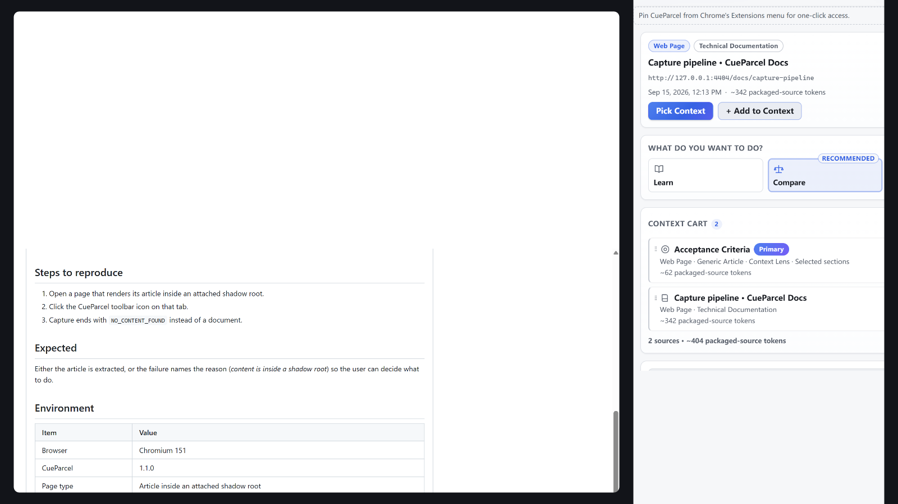

# CueParcel landing page

The static landing page for CueParcel, deployed by
[`.github/workflows/pages.yml`](../.github/workflows/pages.yml) to GitHub Pages at
`https://kallist.github.io/CueParcel/`.

## What this is

Plain static files, uploaded to Pages exactly as they are:

```text
site/
  index.html                     the landing page
  privacy.html                   the privacy policy (the URL given to extension stores)
  styles.css                     all styling, shared by both pages
  main.js                        the only script (reduced-motion GIF fallback)
  assets/                        the real product screenshots and the mark
  .nojekyll                      empty marker; stops Jekyll processing
```

**No build step, no framework, no package manager, no CDN.** Nothing here is
generated: the HTML, `styles.css` and `main.js` are committed as authored, and the
images in `assets/` are copies of the real captures committed under
`docs/assets/`.

`privacy.html` is the canonical public policy at
`https://kallist.github.io/CueParcel/privacy.html`, the URL referenced by the
extension's store listing. It mirrors `PRIVACY.md` at the repository root, and like
the landing page it is a static file with no scripting: `tests/unit/packaging/
launch-packaging.test.ts` asserts that it loads no script, references nothing
outside this project except the project's own GitHub repository and issue tracker,
and still states every privacy promise the store submission relies on.

## Why GitHub Actions instead of branch publishing

Branch-based Pages publishing can only serve the repository **root** or **/docs**.
This page deliberately lives in `site/`, so the workflow uploads `site/` as the
Pages artifact instead. `site/` is therefore the deploy root: `index.html` must sit
at the top of this directory, not in a subdirectory.

## Subpath safety

CueParcel is a **project** Pages site, so it is served under `/CueParcel/`, not at
a domain root. Every reference in this directory is therefore **relative**:

```html
<link rel="stylesheet" href="styles.css">
<link rel="icon" href="assets/cueparcel-mark-dark.svg" type="image/svg+xml">

<script src="main.js" defer></script>
```

A root-absolute path such as `/assets/cueparcel-hero.png` would resolve outside
the project path and 404 on the deployed site, so none are used. `styles.css` has
no `url()` references at all, and `main.js` reads the demo's `src` from the DOM
rather than from a hard-coded path.

The only absolute URLs on the page are links to
`https://github.com/kallist/CueParcel` and its releases, which are meant to leave
the site.

## Local preview

Serve this directory over HTTP from any port — do not open `index.html` via
`file://`, because the reduced-motion fallback fetches the recording's bytes and
browsers block that for local files:

```bash
npx --yes serve site          # or: python -m http.server 8080 --directory site
```

To reproduce the deployed subpath shape, serve the repository root and open
`http://127.0.0.1:<port>/site/`.

## What this page must not become

- No analytics, no telemetry, no tracking pixels, no external requests.
- No framework, bundler or npm site build.
- No claim that CueParcel is available on the Chrome Web Store, and no Trending
  claim.

These are enforced by `tests/unit/packaging/launch-packaging.test.ts`, which fails
the suite if the page gains an external reference or overstates the product.
